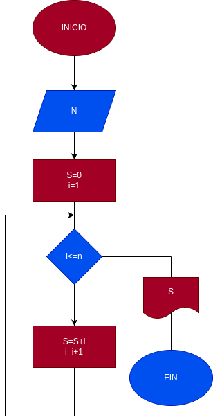

# Suma de los Nprimeros numeros naturales

## input

N = numero escogido al sumar

## Proccesing

- S = 0
- I = 1

mientras que I <= N
- S= S + I
- I= I + 1

si I es igual o mayor a N se detiene y da el resultado
## Diseño

